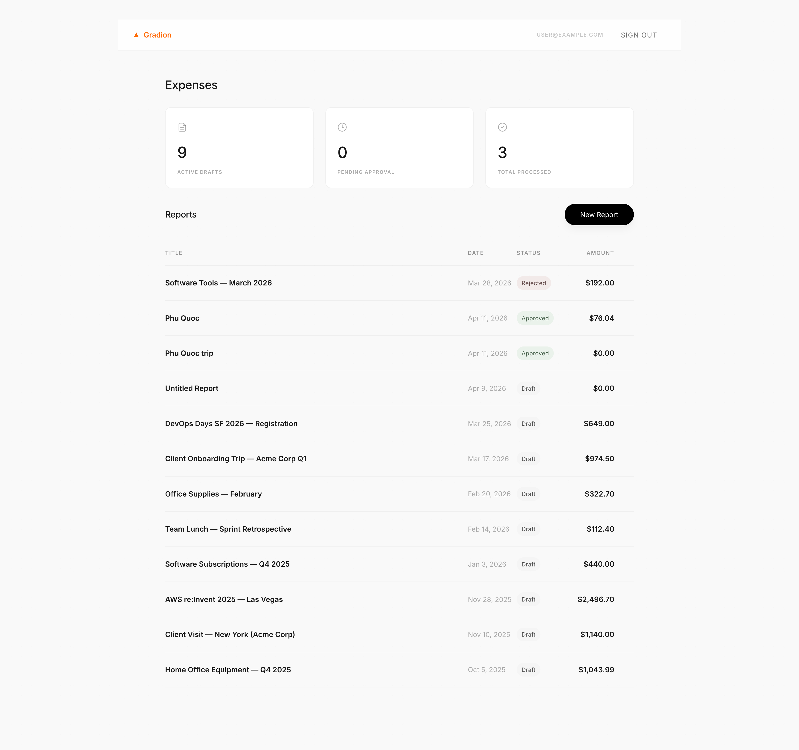
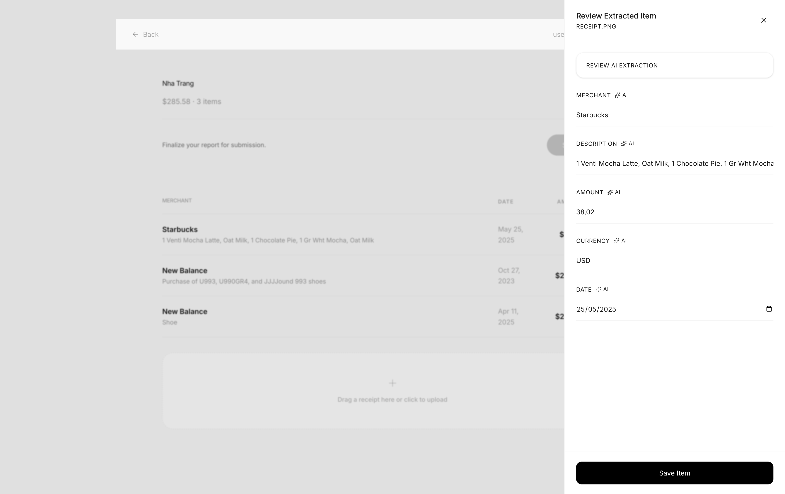

# Gradion Assessment

**Stack:** NestJS · PostgreSQL · MinIO · React + Vite · TanStack Router · pnpm workspaces





---

## Quick Start

**Prerequisites:** Node 20+, pnpm 9+, and Docker.

```bash
pnpm install
cp backend/.env.example backend/.env    # Add AI_PROVIDER_API_KEY (optional)
docker compose up -d                    # Starts Postgres and MinIO, seeds default accounts
pnpm dev
```

- **Web App:** http://localhost:3000
- **API Server:** http://localhost:4000/api/v1

### Seeded Accounts

| Role  | Email             | Password |
| ----- | ----------------- | -------- |
| User  | user@example.com  | password |
| Admin | admin@example.com | password |

---

## Available Commands

| Command             | Description                          |
| ------------------- | ------------------------------------ |
| `pnpm dev`          | Start backend + client in watch mode |
| `pnpm test`         | Run all tests (backend + client)     |
| `pnpm test:backend` | Run backend tests only               |
| `pnpm test:client`  | Run client tests only                |
| `pnpm build`        | Production build                     |
| `pnpm lint`         | Lint + Prettier check                |
| `pnpm format`       | Auto-format                          |

---

## Project Layout

- **backend/**: NestJS API handling business logic, state machines, and storage.
- **client/**: React and Vite UI built with Atomic Design components.
- **shared/**: Shared DTOs, enums, and types.

---

## Documentation

<<<<<<< Updated upstream
```
backend/   NestJS API — business logic, state machine, storage
client/    React + Vite UI — Atomic Design components
shared/    DTOs, enums, and types shared across packages
```

---

## AI usage

Built with Claude (Anthropic) and GitHub Copilot throughout. AI accelerated: initial NestJS module scaffolding, TypeORM entity/migration boilerplate, React component shells, test suite generation, and the Gemini extraction integration. The output was treated as a first draft — not merged blindly.

Three specific corrections where AI output was wrong and I overrode it: (1) the seed script created `admin@example.com` with `role: 'user'`, so the JWT carried the wrong role and all admin API calls returned 403 — caught and fixed manually; (2) the report list mapper was called as `reports.map(mapReport)`, which passes the array index as the optional `totals?` parameter via JavaScript's implicit `(item, index, array)` callback signature — `0 ?? buildTotals(report)` short-circuits on the falsy `0`, producing `$NaN` amounts on every report; (3) the post-login redirect always navigated to `/` regardless of role, so admins landed on the user dashboard instead of `/admin`.

---

## Docs

- [`DECISIONS.md`](./DECISIONS.md) — stack choices, trade-offs, "if I had one more day"
- [`context-layer/WALKTHROUGH.md`](./context-layer/WALKTHROUGH.md) — full local setup, API reference, curl examples
=======
- [**AI Usage**](context-layer/AI_USAGE.md): Notes on tools used and development fixes.
- [**Decisions & Trade-offs**](context-layer/DECISIONS.md): Stack choices and future improvements.
- [**Technical Walkthrough**](./context-layer/WALKTHROUGH.md): Setup, API reference, and curl examples.
>>>>>>> Stashed changes
